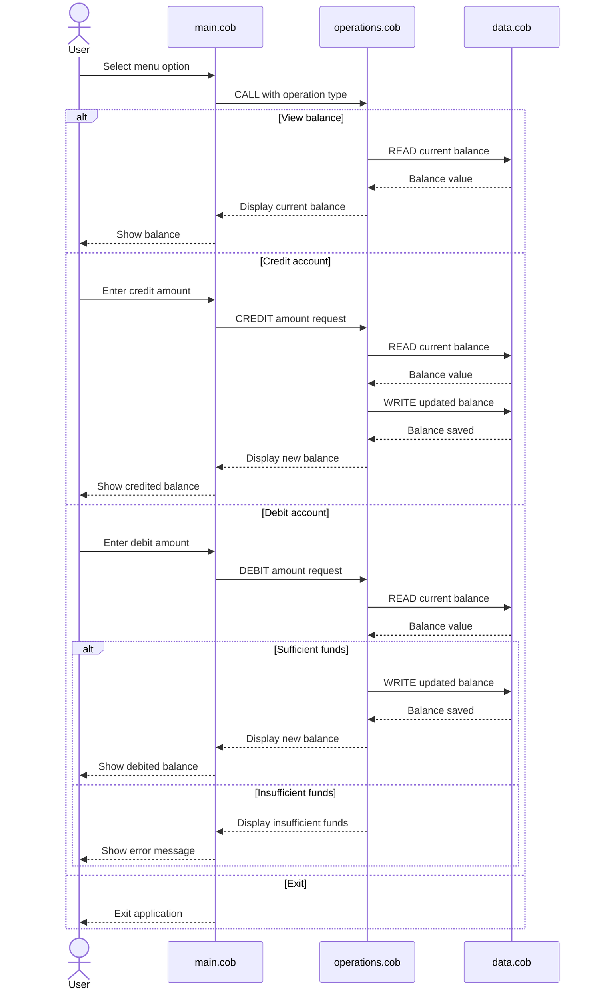

# COBOL Program Overview

This directory documents the COBOL sample application in `src/cobol/`.
The program is a simple account management flow for a student account balance:
users can view the current balance, credit funds, debit funds, or exit.

## File Purposes

### `main.cob`
Main menu program.

Responsibilities:
- Displays the account management menu
- Accepts the user choice
- Routes the request to the operations program
- Exits the application when the user selects option 4

Key logic:
- `MAIN-LOGIC` loops until the user selects exit
- Uses `EVALUATE USER-CHOICE` to dispatch menu options
- Calls `Operations` with one of three commands: `TOTAL`, `CREDIT`, or `DEBIT`

### `operations.cob`
Business logic for account actions.

Responsibilities:
- Reads the requested operation type
- Retrieves the current balance from the data program
- Applies credit or debit changes
- Prevents debits that exceed the available balance

Key logic:
- `TOTAL` reads and displays the current balance
- `CREDIT` prompts for an amount, adds it to the balance, and writes the new value back
- `DEBIT` prompts for an amount, checks that sufficient funds exist, subtracts the amount, and writes the updated balance back
- Displays an insufficient-funds message when the debit amount is greater than the current balance

### `data.cob`
Balance storage program.

Responsibilities:
- Holds the current balance value
- Provides a simple read/write interface for the operations program

Key logic:
- `READ` copies the stored balance into the passed balance field
- `WRITE` replaces the stored balance with the passed value
- Uses `STORAGE-BALANCE` as the in-memory source of truth

## Business Rules for Student Accounts

- The starting balance is `1000.00`.
- A student account can be credited with any entered amount.
- A debit is allowed only when the account has enough funds.
- If the debit amount is larger than the current balance, the program rejects the transaction and leaves the balance unchanged.
- Balance updates are handled through the data program, which currently stores the value in memory only.
- The application is menu-driven and continues running until the user selects exit.

## Program Flow

1. `main.cob` shows the menu.
2. The user selects a command.
3. `main.cob` calls `operations.cob` with the matching operation type.
4. `operations.cob` reads or updates the balance through `data.cob`.
5. The menu returns until the user exits.

## Notes

- The current implementation uses fixed-length COBOL fields for operation codes and balances.
- The stored balance is not persisted to an external file or database.
- The command names passed between programs must match exactly, including trailing spaces where used in the source.

## Sequence Diagram

